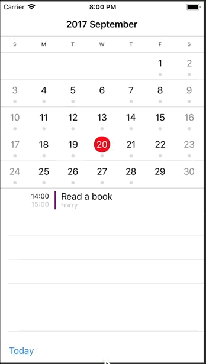
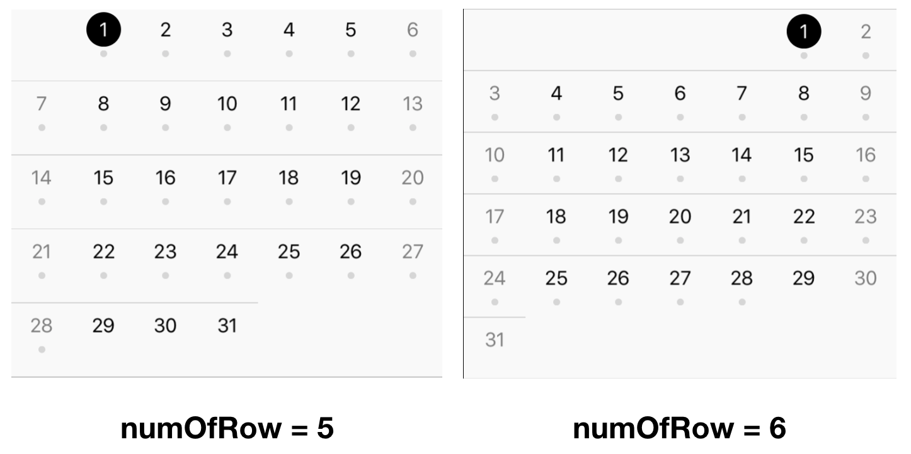

# WLAppleCalendar

這行事曆是仿照 Apple 內建的行事曆做的

使用 [JTAppleCalendar](https://github.com/patchthecode/JTAppleCalendar) library，特色是 UI 可以自己客製化。

下方的行程細節是額外加的，資料是由 `Schedule` 產生隨機的假資料。

過程中遇到最大的困難就是行事曆動態高度的部分，  
當有些月份在行事曆上有五週(2017/11)；有些月份則有六週(2017/12)  
所以當五週要滑到六週時，下面的行程表要往下縮；反之，要往上升。

但此套件提供的動態高度的方式[1]如下：

動態的是每一行的高度，而不是整個行事曆的高度。  
整個行事曆是 `CollectionView`，  
裡面每一格都是 `CollectionViewCell`，  
套件提供的只有 `CollectionViewCell` 的高度是動態，  
但 `CollectionView` 的高度無法動態。

所以我固定了行事曆的高度，  
新建一個高度為 1 的 View，貼在行事曆下方，    
將此 `View` 的 `constraint` 拉到程式裡 (`separatorViewTopConstraint`)，   
然後用個方法[2]來知道現在月份是 5 個 row 還是 6 個 row。  
如果是 5 個 row，`constraint` 的 `constant` 就是一個 cell 的高度的負數；  
反之，constant 就變回 0，這樣就可以達到行事曆動態高度，但 cell 的高度固定了。

註:  

1. 設定時，選擇 [tillEndOfRow] (http://cocoadocs.org/docsets/JTAppleCalendar/7.0.6/Enums/OutDateCellGeneration.html#/s:FO15JTAppleCalendar21OutDateCellGeneration12tillEndOfRowFMS0_S0_) 就會有動態的 cell 高度 (6x7 or 5x7)；   
   選擇 [tillEndOfGrid](http://cocoadocs.org/docsets/JTAppleCalendar/7.0.6/Enums/OutDateCellGeneration.html#/s:FO15JTAppleCalendar21OutDateCellGeneration13tillEndOfGridFMS0_S0_)  就會固定給 6x7 的高度。   
2. 此行事曆進入一個月份會給你三個 array，分別是 inDates/monthDates/outDates。
monthDates 就是在行事曆上，且是這個月份的日期；  
inDates 就是在行事曆上，且是上個月份的日期；   
outDates 就是在行事曆上，且是下個月份的日期；  
所以方法就是用 tillEndOfGrid 選項來固定高度，就會每次都產生 outDates，  
再判斷 outDates.count < 7，如果成立就是有 6 rows。
 

